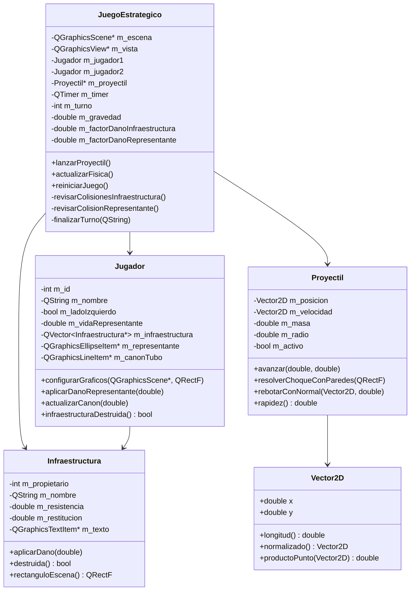

# Diagrama de clases - Actividad 2

## Relaciones

- `JuegoEstrategico` administra toda la simulacion: escena, turnos, controles, proyectil activo y reglas de victoria.
- Cada `Jugador` posee su representante, su canon y una lista de objetos `Infraestructura`.
- `Infraestructura` hereda de `QGraphicsRectItem`, por eso se puede dibujar directamente en la escena.
- `Proyectil` hereda de `QGraphicsEllipseItem` y ademas mantiene su estado fisico interno.
- `Vector2D` evita mezclar calculos fisicos con objetos graficos de Qt.
